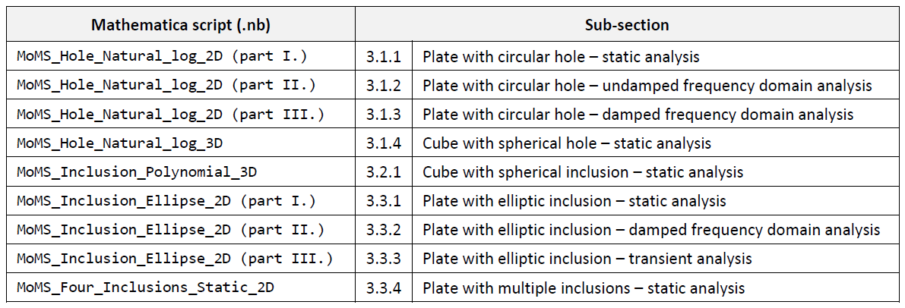

This repository contains supplementary material for the Article

---

>**Code Verification of Immersed Boundary Techniques using the Method of Manufactured Solutions**
>
>M. Petö, M. Gorji, F. Duvigneau, A. Düster, D. Juhre, and S. Eisenträger
>
>Computational Mechanics (2023)

---

The provided Wolfram Mathematica (12.0) notebooks contain the symbolic derivations of the manufactured solutions used in the paper. The table below summarizes which notebook is associated with which sections in the paper. Furthermore, in all the notebooks, comments are given to locate the equations, figures and tables in the article the derived results correspond to. Note that a given notebook can correspond to multiple sections in the article. These notebooks are divided into different parts.

**Usage**: In order to run the notebooks, the notebook `Utility_functions.nb` should be executed first, which defines the functions related to the computation of the stress and strain tensors, as well as the divergence operator in the different coordinate systems. Note that the execution of the mentioned notebook clears all global variables.

**Disclaimer**: The sole goal of the Mathematica scripts is to achieve a correct and understandable derivation of the manufactured solutions. Note that the scripts are not optimized for performance.

**Cite**: When using the methods or results provided in the paper and supplementary material, please cite our work accordingly.
